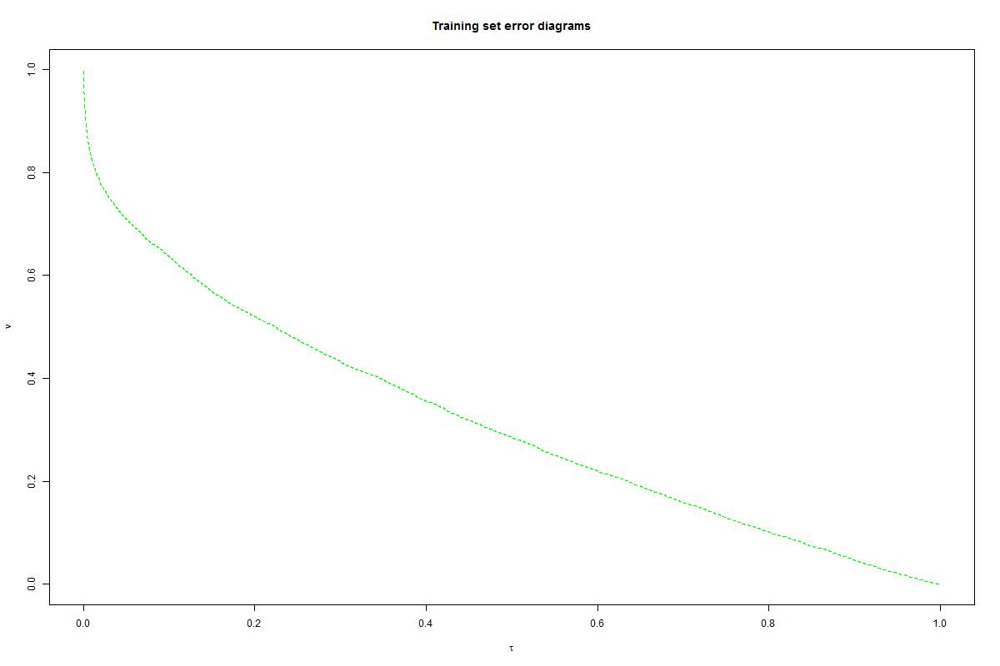
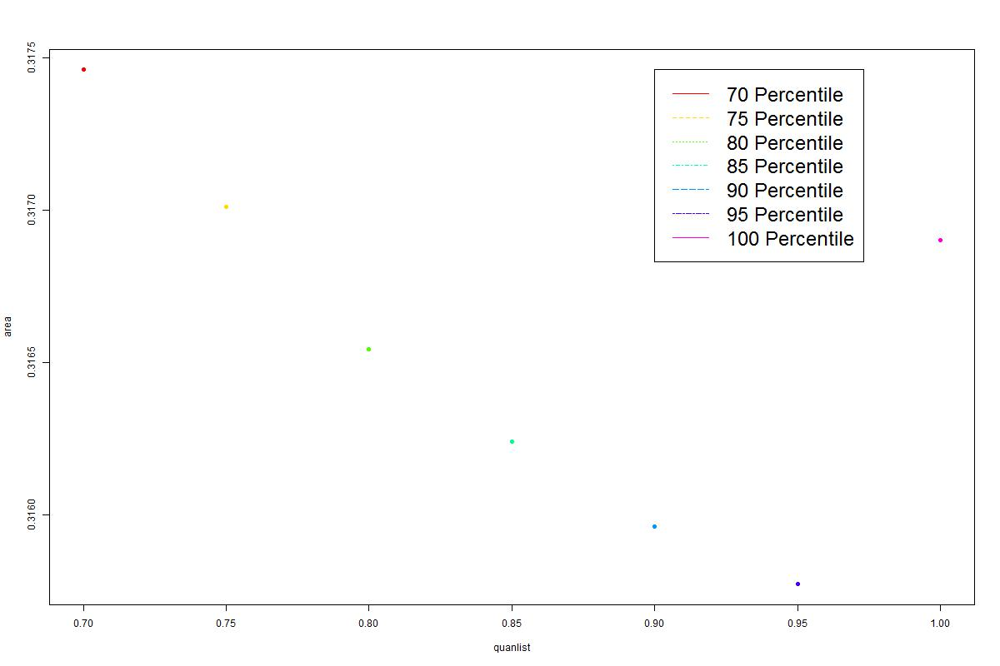

We want to try this really simple model: pick a cutoff time for the successors that we want to cover by our alarm. We pick the cutoff time by looking at event times of the successors of earthquakes within a range as the data and find a specific percentile of the data. The percentiles will be our lengths of alarm window for earthquakes with magnitudes in that range.  

For example, we found the 90-percentiles of the successor-times of earthquakes with magnitude from 3 to 7.5 with bin size 0.1:   
  

Then, with such formulation, we plot the error diagram:  
  

-----
What percentile will be the best to set as cutoff?  
How many successors to consider will make the model perform better?  
Let's play with these parameters!!  

First we set number of successors = 1, and try 70, 75, 80, 85, 90, 95, 100 percentiles.  
Error diagram:  
  

It's hard to compare, let's calculate the area under the curve:  
  
